# PERSONAL COCKTAIL CODEX


# OVERVIEW


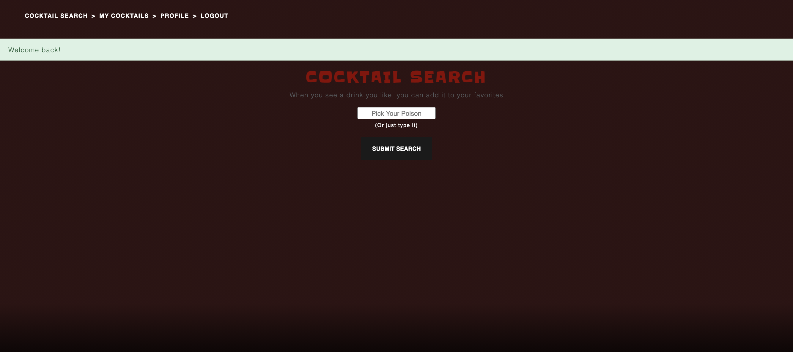
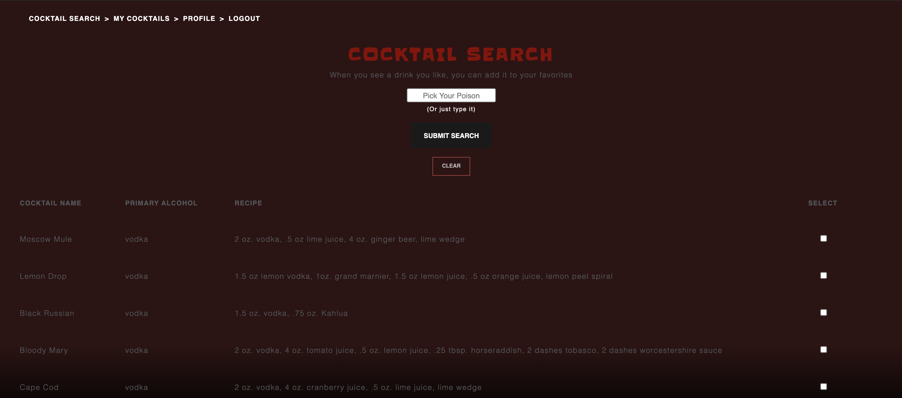
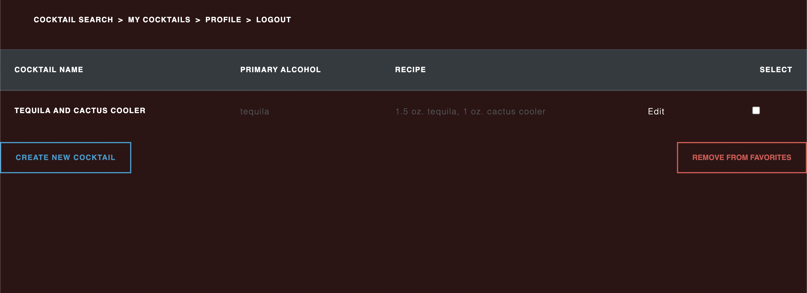
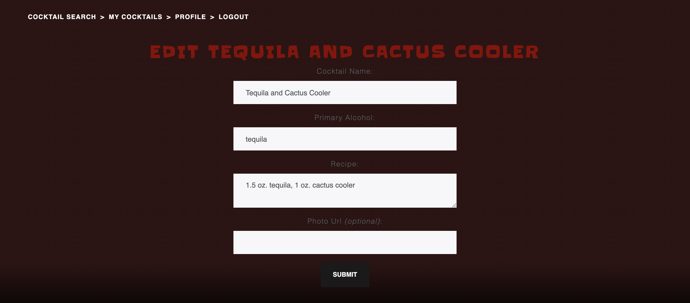

This a is REST API using a Postgres SQL database. The core functionality will allow the user to search pre-populated cocktail recipes in our database. The user can add those to his profile for future easy reference and revisit to customize the recipes, including a delete from favorites. The relational database utilizes Many-to-Many relationships.

The app is currently deployed on [Heroku](https://cocktail-codex.herokuapp.com/).

## USER STORIES
- As a user, I want to be able to search available cocktail recipes by drink name. 
- As a user, I want to be able to search available cocktail recipes by primary alcohol.
- As a user, I want to be able to add some cocktail recipes to a list of favorites. 
- As a user, I want to be able to customize my favorite drink recipes. 
- As a user, I want to be able to delete cocktail recipes I don’t like anymore. 

## INSTALLATION
1. Please read the below list of required modules and verify if they are installed.
  - Use NPM to install missing modules. 
2. Create an `.env' file and put your own session secret in it inside of your cloned repo.
  - Ex.: ```SESSION_SECRET=bleepbloopformetoo```
3. Create a database: ```createdb cocktail_codex_development```
4. Migrate the database: ```sequelize db:migrate```
5. Populate the database: ```sequelize db:seed:all```
6. Initialize the server in Node.
7. Open a browser window and access local server URL: ```localhost:3000```

#### LIST OF REQUIRED PLATFORMS/SOFTWARES
* Postgres
* Node and Node Package Manager 

#### LIST OF REQUIRED NODE MODULES 
* Express
* EJS Layouts
* Express Session
* Sequelize
* Passport
* Morgan
* Method Override
* DotEnv
* Connect-Flash
* Bcrypt


### WIREFRAMES 
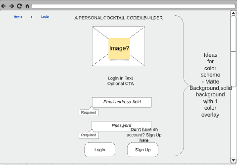
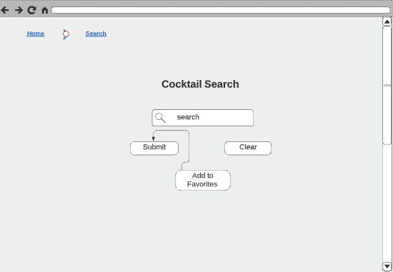
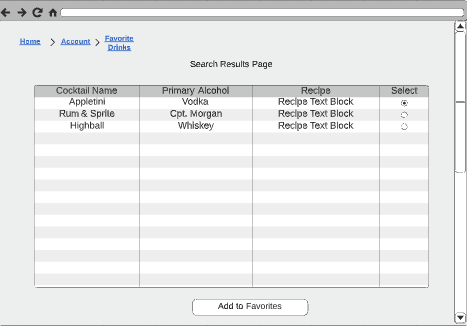
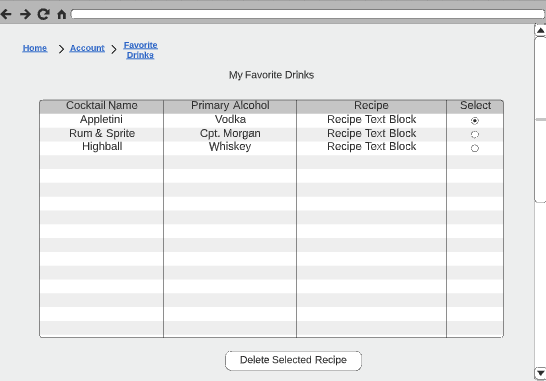
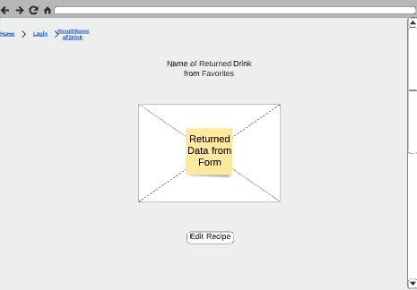
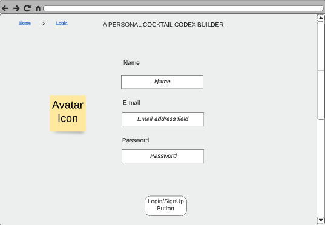
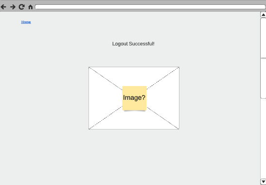


### ERD 

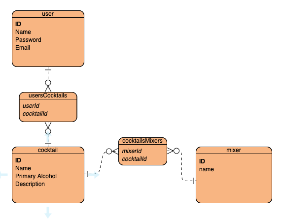
